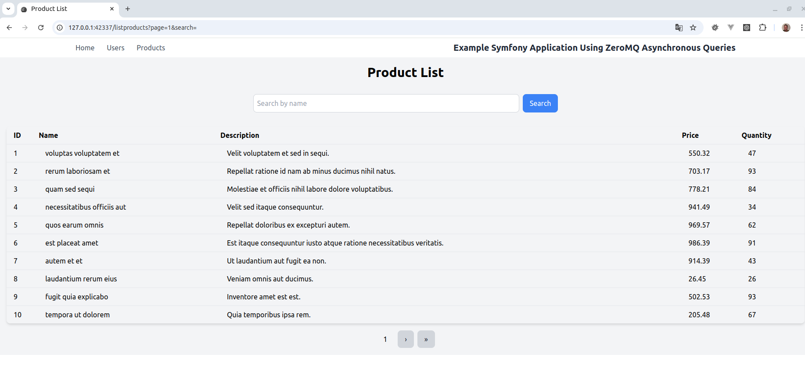

### symfony_async

An example of how to use https://github.com/PaulNovack/CppZeroMQAsynchSQLServer in a fresh symfony project by creating a CustomRepository

To work better with CppZeroMQAsynchSQLServer the server should return error responses better.

